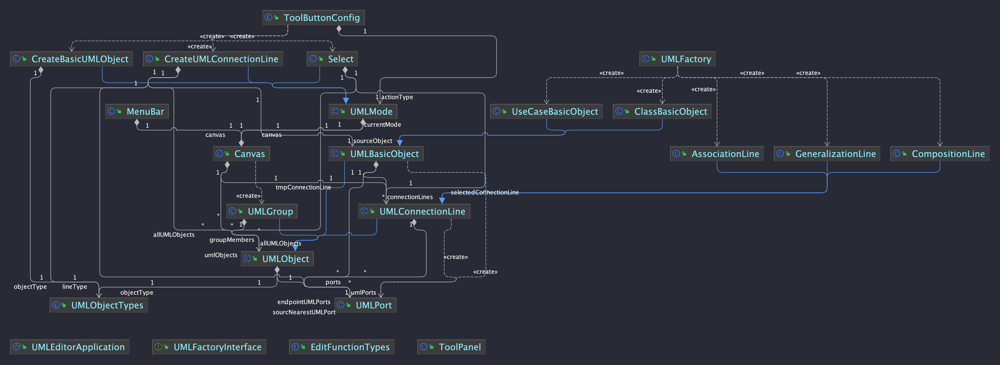
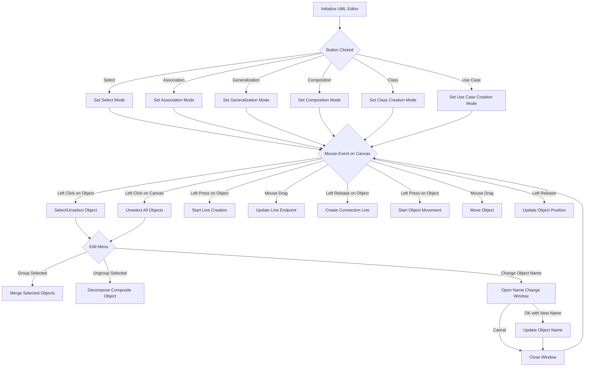
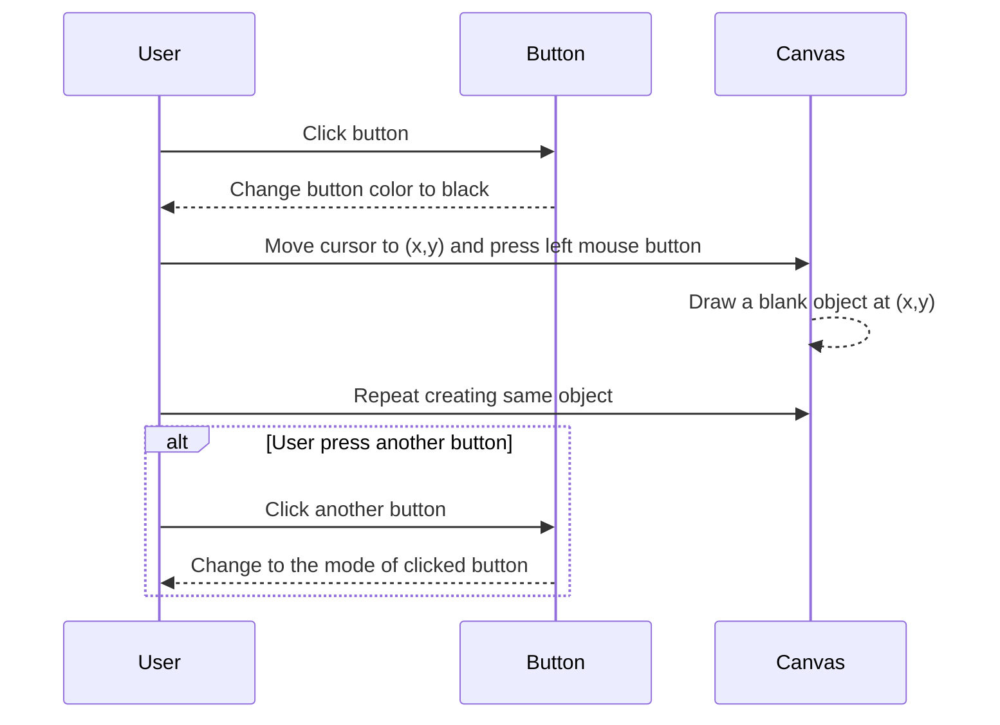
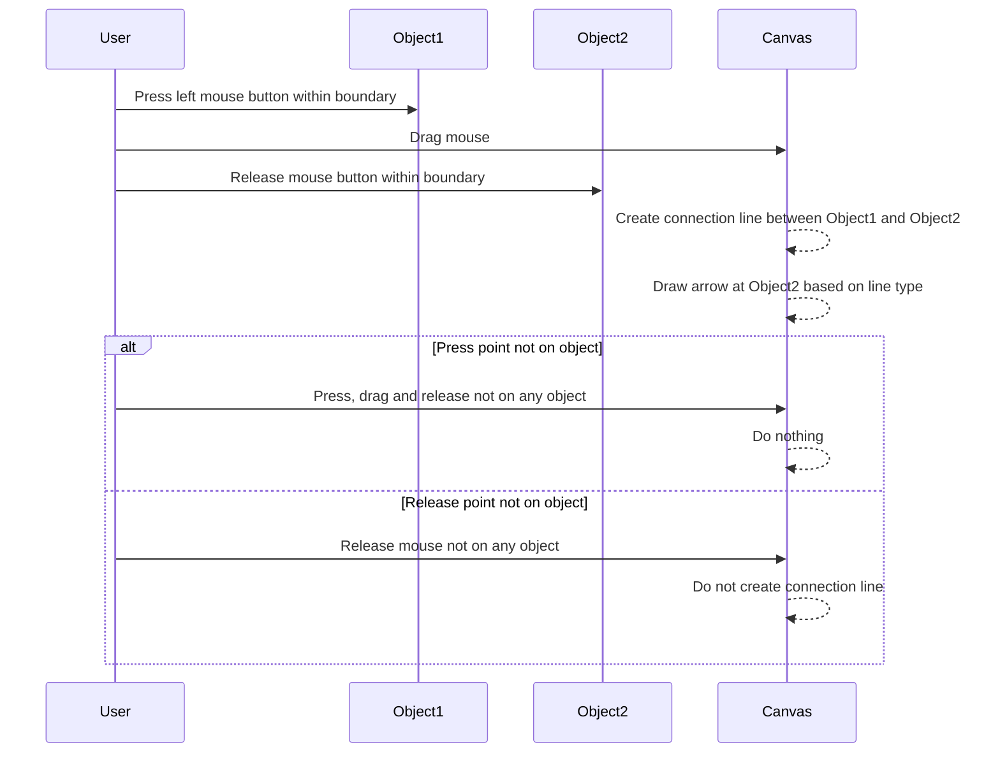
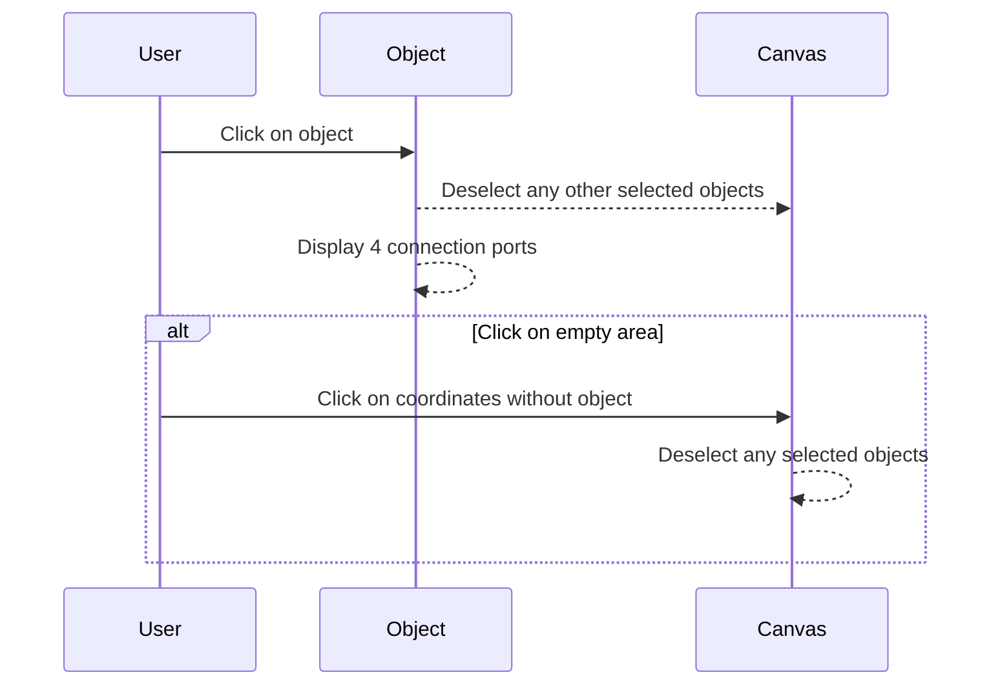
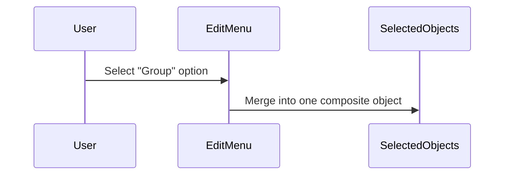
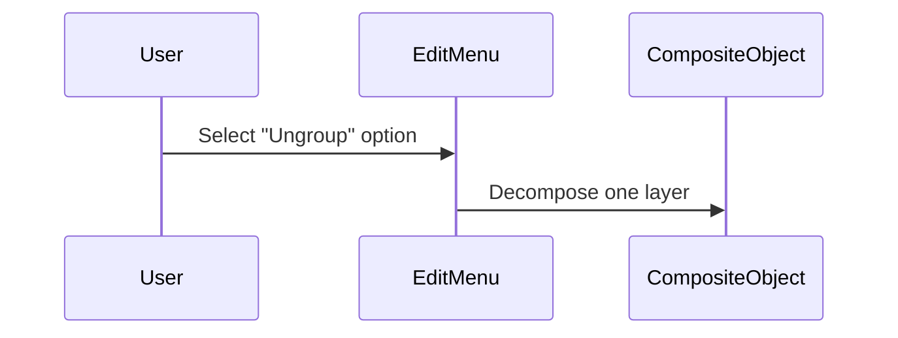
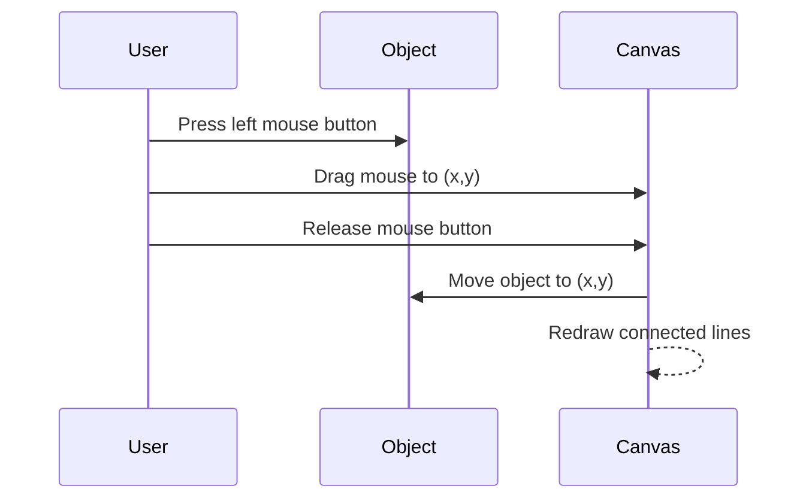
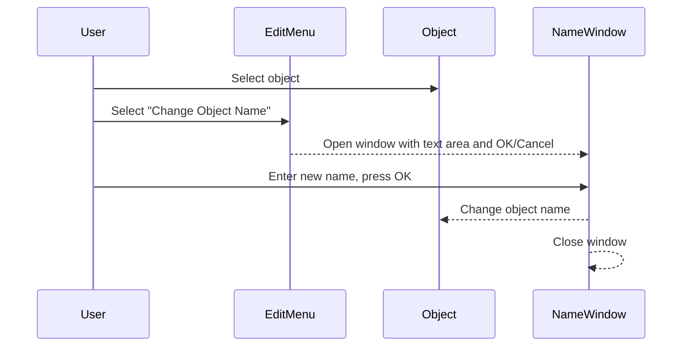

[](https://xxrjun.github.io/uml-editor)
[](https://github.com/xxrjun/uml-editor/releases/tag/v1.0)

[](https://sonarcloud.io/summary/new_code?id=xxrjun_uml-editor)
[](https://sonarcloud.io/summary/new_code?id=xxrjun_uml-editor)
[](https://sonarcloud.io/summary/new_code?id=xxrjun_uml-editor)

<br />
<div align="center">
  <a href="https://github.com/xxrjun/uml-editor">
    
  </a>
<h3 align="center">UML Editor</h3>

  <p align="center">
     NCU OOAD | Spring 2024 | Final Project
    <br />
    <a href="https://xxrjun.github.io/uml-editor/"><strong>JavaDocs »</strong></a>
    <br />
    <a href="."><strong>DEMO »</strong></a>
    <br />
    <br />
    <!-- <a href="">View Demo</a> -->
  </p>
</div>

# UML Editor

- [UML Editor](#uml-editor)
  - [Software Requirements](#software-requirements)
    - [Maven Dependencies](#maven-dependencies)
  - [Features](#features)
    - [GUI Layout and Buttons](#gui-layout-and-buttons)
    - [Functions](#functions)
    - [Extra Features](#extra-features)
  - [Usage](#usage)
    - [Build](#build)
    - [Run](#run)
  - [Class Diagram](#class-diagram)
  - [Future Work](#future-work)
  - [Project File Structure](#project-file-structure)
  - [Program Flow Overview](#program-flow-overview)
  - [Use Case Sequence Diagram](#use-case-sequence-diagram)
    - [A. Creating a UML Object](#a-creating-a-uml-object)
    - [B. Creating a UML Connection Line](#b-creating-a-uml-connection-line)
    - [C. Select/Unselect a Single Object](#c-selectunselect-a-single-object)
    - [D.1 Group Objects](#d1-group-objects)
    - [D.2 Ungroup Objects](#d2-ungroup-objects)
    - [E. Move Objects](#e-move-objects)
    - [F. Change Object Name](#f-change-object-name)
  - [References](#references)
    - [Documentations](#documentations)
    - [Related Projects](#related-projects)

## Software Requirements

- IDE: IntelliJ IDEA
- Java JDK 17.0.1
- GUI Library: [Java Swing](https://docs.oracle.com/javase%2F7%2Fdocs%2Fapi%2F%2F/javax/swing/package-summary.html)
- [SonarLint Plugin](https://plugins.jetbrains.com/plugin/7973-sonarlint) - Code quality and security analysis tool
- [Maven](https://mvnrepository.com/) - Dependency Management
- [Figma](https://www.figma.com/) - UI and components design
- Documentation
  - [Generate JavaDoc](https://www.jetbrains.com/help/idea/javadocs.html#generate-javadoc) - IntelliJ IDEA Tool
  - [Deploy - Publish Javadoc](https://github.com/marketplace/actions/deploy-publish-javadoc) - GitHub Action

### Maven Dependencies

- Logger: [slf4j](http://www.slf4j.org/) with [logback](http://logback.qos.ch/)

## Features

### GUI Layout and Buttons

- [x] Select
- [x] Association
- [x] Generalization
- [x] Composition
- [x] Class
- [x] Use Case

### Functions

- [x] Create basic object: Class, UseCase
- [x] Select/Unselect/Move a single basic object: Class, UseCase
- [x] Create UMLConnectionLine: AssociationLine, CompositionLine, GeneralizationLine
- [x] Change Object Name
- [x] Select/Unselect/Move connection line
- [x] Select/Unselect a UMLGroup of objects
- [x] Group/UpGroup
- [x] Select and Move BaseUMLObject (include Group)

### Extra Features

- [ ] Delete UMLObject


## Usage

You can just download [🌔 v1.0](https://github.com/xxrjun/uml-editor/releases/tag/v1.0) and run the jar file.

### Build

```bash
mvn clean package
```

### Run

```bash
java -jar target/uml-editor-1.0-jar-with-dependencies.jar
```

## Class Diagram with Dependency

> [!TIP]
> Generated by [UML class diagrams](https://www.jetbrains.com/help/idea/class-diagram.html)




## Future Work

- Improve code quality. More OO.
- Documentations: Java API Docs, README.md

## Project File Structure

```bash
.
|
+---assets
+---docs
+---src
|   +---main
|   |   +---java
|   |   |   \---com
|   |   |       \---xxrjun
|   |   |           |   UMLEditorApplication.java
|   |   |           |
|   |   |           +---components
|   |   |           |   |   Canvas.java
|   |   |           |   |   MenuBar.java
|   |   |           |   |   ToolPanel.java
|   |   |           |   |
|   |   |           |   \---uml
|   |   |           |       |   UMLGroup.java
|   |   |           |       |   UMLObject.java
|   |   |           |       |   UMLPort.java
|   |   |           |       |
|   |   |           |       +---basics
|   |   |           |       |       ClassBasicObject.java
|   |   |           |       |       UMLBasicObject.java
|   |   |           |       |       UseCaseBasicObject.java
|   |   |           |       |
|   |   |           |       \---connectionlines
|   |   |           |               AssociationLine.java
|   |   |           |               CompositionLine.java
|   |   |           |               GeneralizationLine.java
|   |   |           |               UMLConnectionLine.java
|   |   |           |
|   |   |           +---enums
|   |   |           |       EditFunctionTypes.java
|   |   |           |       ToolButtonConfig.java
|   |   |           |       UMLObjectTypes.java
|   |   |           |
|   |   |           +---factories
|   |   |           |       UMLObjectFactory.java
|   |   |           |
|   |   |           \---modes
|   |   |                   CreateBasicUMLObject.java
|   |   |                   CreateUMLConnectionLine.java
|   |   |                   Select.java
|   |   |                   UMLFactory.java
|   |   |                   UMLMode.java
|   |   |
|   |   \---resources
|   |       \---images
...
```

## Program Flow Overview

1. Click Tool Button
2. Mode
   1. Create UMLObject
      1. Create UMLConnectionLine
      2. Create UMLBasicObject
   2. Select
      1. If selection is UMLObjects
         1. can Move (UMLConnectionLine movement are not supported yet.)
      2. If selection is UMLBasicObject
         1. can change it’s ObjectName
      3. If selection is an Area including several UMLObjects
         1. can Group
      4. If selection is an UMLGroup
         1. can UnGroup
3. Canvas Repaint



## Use Case Sequence Diagram

### A. Creating a UML Object



### B. Creating a UML Connection Line



### C. Select/Unselect a Single Object



### D.1 Group Objects



### D.2 Ungroup Objects




### E. Move Objects



### F. Change Object Name



## References

### Documentations

- [Requirement - Use Case Format](./docs/requirement%20-%20use%20case%20format.pdf)
- [Java Design Pattern](https://java-design-patterns.com/patterns/)
- [Package javax.swing](https://docs.oracle.com/en/java/javase/17/docs/api/java.desktop/javax/swing/package-summary.html)
- [Java Swing Tutorial](https://www.javatpoint.com/java-swing)
- [The Java™ Tutorials | Creating a GUI With Swing](https://docs.oracle.com/javase/tutorial/uiswing/index.html)

### Related Projects

> [!TIP]
> Code similarity is checked by using [MOSS](https://theory.stanford.edu/~aiken/moss/). Result: http://moss.stanford.edu/results/1/9411843636512/

- [haVincy/UML-Editor](https://github.com/haVincy/UML-Editor)
- [MU-PING/UML-editor](https://github.com/MU-PING/UML-editor)
- [wst24365888/XYZ-UML-Editor](https://github.com/wst24365888/XYZ-UML-Editor?tab=readme-ov-file)
