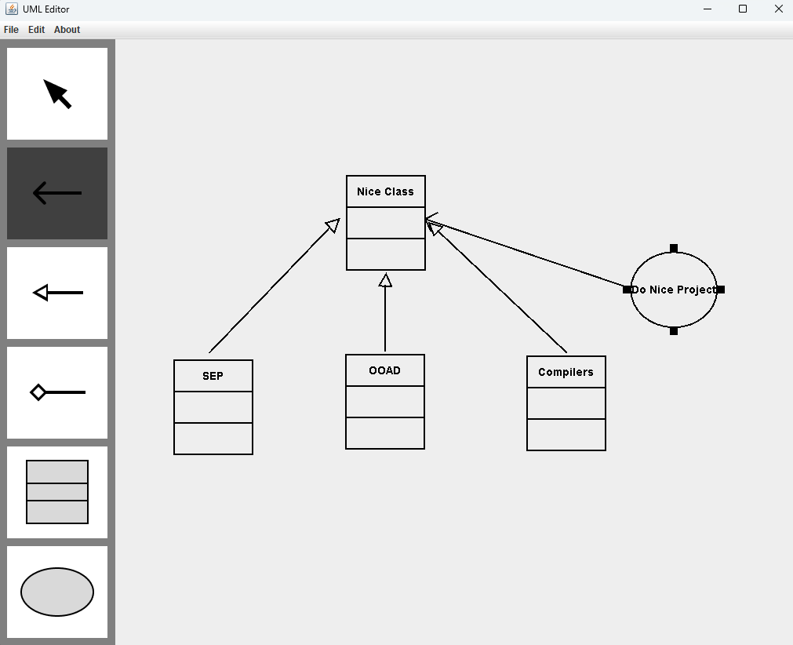
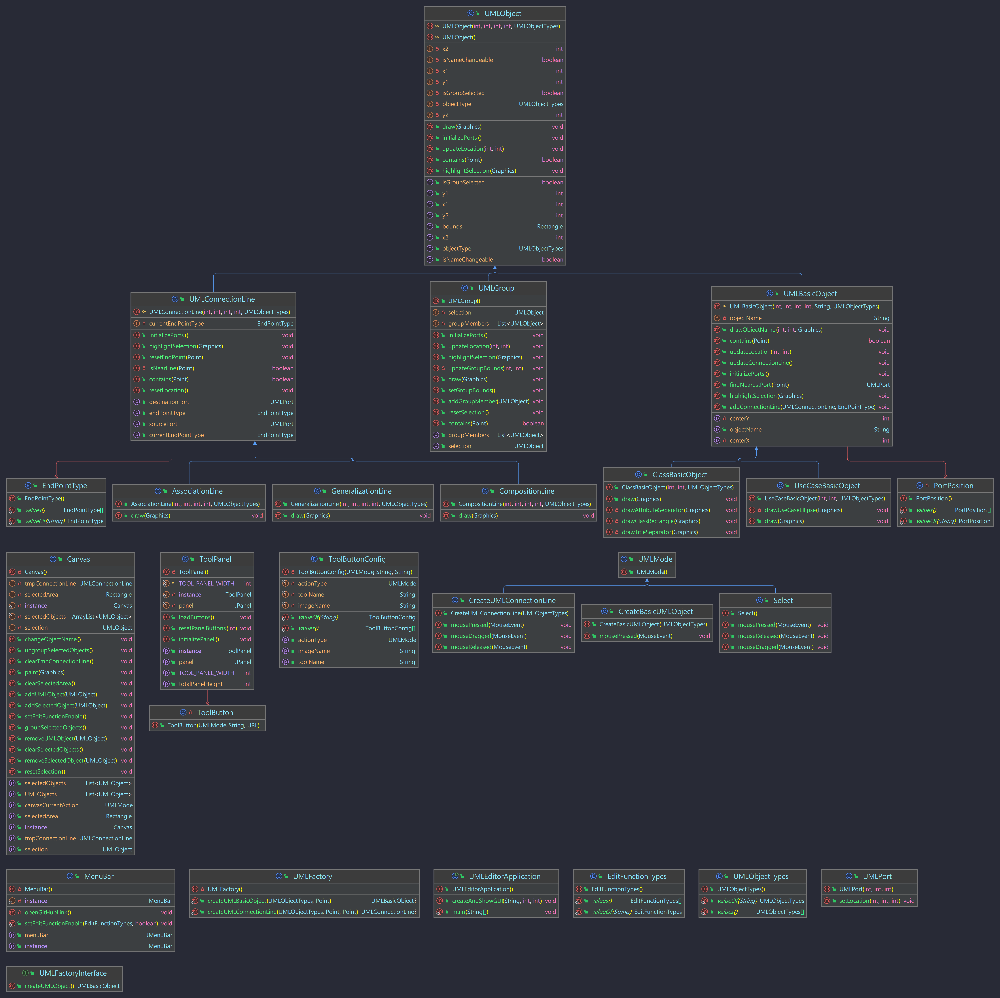

<br />
<div align="center">
  <a href="https://github.com/xxrjun/uml-editor">
    
  </a>
<h3 align="center">UML Editor</h3>

  <p align="center">
     NCU OOAD | Spring 2024 | Final Project
    <br />
    <a href="."><strong>DEMO »</strong></a>
    <br />
    <br />
    <!-- <a href="">View Demo</a> -->
  </p>
</div>

# UML Editor

- [Demo](#demo)
- [Software Requirements](#software-requirements)
  - [Maven Dependencies](#maven-dependencies)
- [Features](#features)
  - [GUI Layout \& Buttons](#gui-layout--buttons)
  - [Functions](#functions)
  - [Extra Features](#extra-features)
- [Program Flow Overview](#program-flow-overview)
- [Future Work](#future-work)
- [Project Structure](#project-structure)
- [Usage](#usage)
  - [Build](#build)
  - [Run](#run)
- [Class Diagram](#class-diagram)
- [References](#references)
  - [Documentations](#documentations)
  - [Related Projects](#related-projects)

## Demo

> TODO

## Software Requirements

- IDE: IntelliJ IDEA
- Java JDK 17.0.1
- GUI Library: [Java Swing](https://docs.oracle.com/javase%2F7%2Fdocs%2Fapi%2F%2F/javax/swing/package-summary.html)
- [SonarLint Plugin](https://plugins.jetbrains.com/plugin/7973-sonarlint) - Code quality and security analysis tool
- [Maven](https://mvnrepository.com/) - Dependency Management
- [Figma](https://www.figma.com/) - UI and components design

### Maven Dependencies

- Logger: [slf4j](http://www.slf4j.org/) with [logback](http://logback.qos.ch/)

## Features

### GUI Layout & Buttons

- [x] Select
- [x] Association
- [x] Generalization
- [x] Composition
- [x] Class
- [x] Use Case

### Functions

- [x]  Create basic object: Class, UseCase
- [x]  Select/Unselect/Move a single basic object: Class, UseCase
- [x]  Create UMLConnectionLine: AssociationLine, CompositionLine, GeneralizationLine
- [x]  Change Object Name
- [x]  Select/Unselect/Move connection line
- [x]  Select/Unselect a UMLGroup of objects
- [x]  Group/UpGroup
- [x]  Select and Move BaseUMLObject (include Group)

### Extra Features

- [ ]  Delete UMLObject


## Program Flow Overview

1. Click Tool Button
2. Mode
    1. Create UMLObject
        1. Create UMLConnectionLine
        2. Create UMLBasicObject
    2. Select
        1. If selection is UMLObjects
            1. can Move (UMLConnectoinLine movement are not supported yet.)
        2. If selection is UMLBasicObject
            1.  can change it’s ObjectName
        3. If selection is an Area including several UMLObjects
            1. can Group
        4. If selection is an UMLGroup
            1. can UnGroup
3. Canvas Repaint

## Future Work

- Improve code quality. More OO.
- Documentation

## Usage

You can just download [🌔 v1.0](https://github.com/xxrjun/uml-editor/releases/tag/v1.0) and run the jar file.

### Build

```bash
mvn clean package
```

### Run

```bash
java -jar target/uml-editor-1.0-jar-with-dependencies.jar
```

## Project File Structure
    
```bash 
.
|   
+---assets
|       banner-origin.png
|       banner.png
|       class-diagram.png
|
+---docs
|       Development.md
|       requirement - use case format.pdf
|
+---src
|   +---main
|   |   +---java
|   |   |   \---com
|   |   |       \---xxrjun
|   |   |           |   UMLEditorApplication.java
|   |   |           |
|   |   |           +---components
|   |   |           |   |   Canvas.java
|   |   |           |   |   MenuBar.java
|   |   |           |   |   ToolPanel.java
|   |   |           |   |
|   |   |           |   \---uml
|   |   |           |       |   UMLGroup.java
|   |   |           |       |   UMLObject.java
|   |   |           |       |   UMLPort.java
|   |   |           |       |
|   |   |           |       +---basics
|   |   |           |       |       ClassBasicObject.java
|   |   |           |       |       UMLBasicObject.java
|   |   |           |       |       UseCaseBasicObject.java
|   |   |           |       |
|   |   |           |       \---connectionlines
|   |   |           |               AssociationLine.java
|   |   |           |               CompositionLine.java
|   |   |           |               GeneralizationLine.java
|   |   |           |               UMLConnectionLine.java
|   |   |           |
|   |   |           +---enums
|   |   |           |       EditFunctionTypes.java
|   |   |           |       ToolButtonConfig.java
|   |   |           |       UMLObjectTypes.java
|   |   |           |
|   |   |           \---modes
|   |   |                   CreateBasicUMLObject.java
|   |   |                   CreateUMLConnectionLine.java
|   |   |                   Select.java
|   |   |                   UMLFactory.java
|   |   |                   UMLFactoryInterface.java
|   |   |                   UMLMode.java
|   |   |
|   |   \---resources
|   |       \---images
|   |               association-line.png
|   |               class.png
|   |               composition-line.png
|   |               generalization-line.png
|   |               select.png
|   |               use-case.png
|   |
|   \---test
|       \---java
...
```

## Class Diagram

Generated by [UML class diagrams](https://www.jetbrains.com/help/idea/class-diagram.html)




## References

### Documentations

- [Requirement - Use Case Format](./docs/requirement%20-%20use%20case%20format.pdf)
- [Java Design Pattern](https://java-design-patterns.com/patterns/)
- [Package javax.swing](https://docs.oracle.com/en/java/javase/17/docs/api/java.desktop/javax/swing/package-summary.html)
- [Java Swing Tutorial](https://www.javatpoint.com/java-swing)
- [The Java™ Tutorials | Creating a GUI With Swing](https://docs.oracle.com/javase/tutorial/uiswing/index.html)

### Related Projects
- [haVincy/UML-Editor](https://github.com/haVincy/UML-Editor)
- [MU-PING/UML-editor](https://github.com/MU-PING/UML-editor)
- [wst24365888/XYZ-UML-Editor](https://github.com/wst24365888/XYZ-UML-Editor?tab=readme-ov-file)