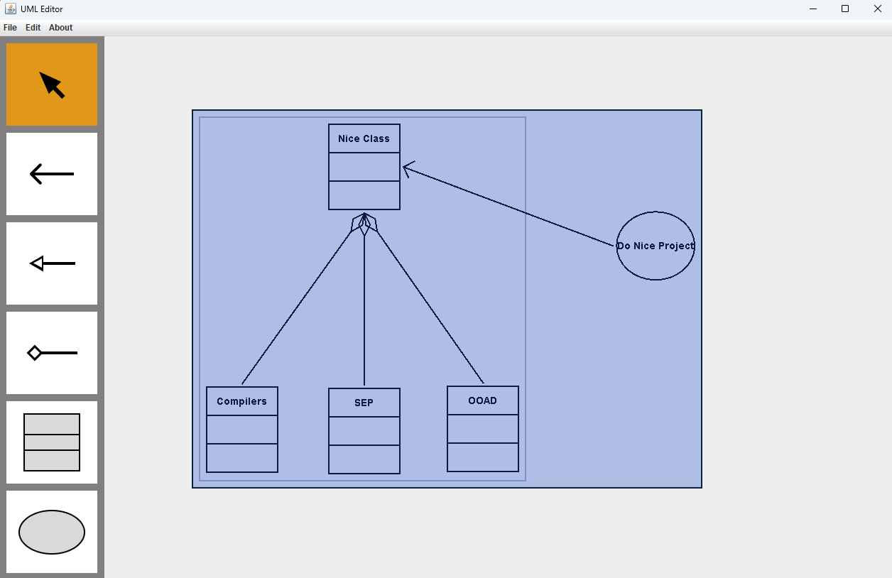

 

  

<h3 align="center">UML Editor</h3>

  

     NCU OOAD | Spring 2024 | Final Project
     
    <a href="."><strong>DEMO »</strong></a>
     
     
    <!-- <a href="">View Demo</a> -->
  

# UML Editor

- [Demo](#demo)
- [Software Requirements](#software-requirements)
- [How to run](#how-to-run)
- [Class Diagram](#class-diagram)
- [References](#references)

## Demo

## Software Requirements

- IDE: IntelliJ IDEA
- Java JDK 17.0.1
- GUI Library: [Java Swing](https://docs.oracle.com/javase%2F7%2Fdocs%2Fapi%2F%2F/javax/swing/package-summary.html)
- [SonarLint Plugin](https://plugins.jetbrains.com/plugin/7973-sonarlint) - Code quality and security analysis tool
- [Maven](https://mvnrepository.com/) - Dependency Management
- Figma - UI and components design

### Maven Dependencies

- Logger: [slf4j](http://www.slf4j.org/) with [logback](http://logback.qos.ch/)

## Features

### GUI Layout & Buttons

- [x] Select
- [x] Association
- [x] Generalization
- [x] Composition
- [x] Class
- [x] Use Case

### Functions

- [x]  Create basic object: Class, UseCase
- [x]  Select/Unselect/Move a single basic object: Class, UseCase
- [x]  Create UMLConnectionLine: AssociationLine, CompositionLine, GeneralizationLine
- [ ]  Select/Unselect/Move connection line
- [ ]  Change Object Name
- [ ]  Select/Unselect a group of objects
- [ ]  Group/UpGroup
- [ ]  Select and Move BaseUMLObject (include Group)

### Use Case

## Usage

> TODO

## Class Diagram

> TODO

## References

### Documentations

- [Requirement - Use Case Format](./docs/requirement%20-%20use%20case%20format.pdf)
- [Java Design Pattern](https://java-design-patterns.com/patterns/)
- [Package javax.swing](https://docs.oracle.com/en/java/javase/17/docs/api/java.desktop/javax/swing/package-summary.html)
- [Java Swing Tutorial](https://www.javatpoint.com/java-swing)
- [The Java™ Tutorials | Creating a GUI With Swing](https://docs.oracle.com/javase/tutorial/uiswing/index.html)

### Related Projects

- [haVincy/UML-Editor](https://github.com/haVincy/UML-Editor)
- [MU-PING/UML-editor](https://github.com/MU-PING/UML-editor)
- [wst24365888/XYZ-UML-Editor](https://github.com/wst24365888/XYZ-UML-Editor?tab=readme-ov-file)